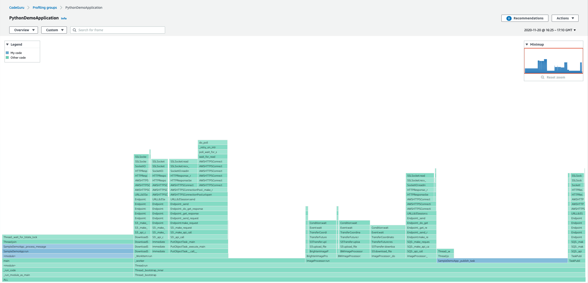

# Amazon CodeGuru Profiler Python Demo Application

Simple Python application for demonstrating the features of [Amazon CodeGuru Profiler](https://aws.amazon.com/codeguru/).



## How it works

The application does some basic image processing, with some CPU-heavy
operations alongside some IO-heavy operations.

It consists chiefly of two components which run in parallel, the task publisher
and the image processor.

CodeGuru Profiler Python agent runs inside the application, in the same way any real application
would use it. It collects and reports profiling data about the application, ready to
be viewed in the AWS console.

##### [`TaskPublisher`](aws_python_sample_application/task_publisher.py)

Checks the S3 bucket for available images, and submits the name of some of these images
to the SQS queue.

##### [`ImageProcessor`](aws_python_sample_application/image_processor.py)

Polls SQS for names of images to process. Processing an image involves downloading
it from S3, applying some image transforms (e.g. converting to monochrome), and
uploading the result back to S3.

## Setup

Here is the summary of the steps that follow.

1. Make sure you have installed the latest version of [AWS CLI](https://docs.aws.amazon.com/cli/latest/userguide/cli-chap-welcome.html).
Use an IAM entity for the AWS CLI that has permissions to access CodeGuru Profiler, S3 and SQS to create all the required components for the demo application to run.
2. Create a profiling group in CodeGuru Profiler, named `PythonDemoApplication`.
3. Create a S3 bucket, e.g. `s3://python-demo-application-test-bucket`. Note, the bucket name must be unique across all of Amazon S3.
See [here](https://docs.aws.amazon.com/cli/latest/reference/s3/mb.html) for more details.
4. Create an SQS queue, e.g. `DemoApplicationQueue`. See [here](https://docs.aws.amazon.com/cli/latest/reference/sqs/create-queue.html)
for more details.
5. Create virtual environment with venv, e.g. `python3 -m venv ./venv`.
6. Activate the virtual environment, e.g. `source venv/bin/activate`.
7. Install dependency `boto3` and `skimage` through pip3 that are used for the demo application.
8. Install the Python agent `codeguru_profiler_agent` through pip3.

Here are the commands to run on your machine.

```bash
aws configure # Set up your AWS credentials and region as usual.
```

```bash
aws codeguruprofiler create-profiling-group --profiling-group-name PythonDemoApplication

# It is required to set the DEMO_APP_BUCKET_NAME and DEMO_APP_SQS_URL environment applications for later running the demo application.

# Make sure you update `YOUR-BUCKET-NAME-REPLACE-ME`with a bucket name that is unique across all of Amazon S3.
export DEMO_APP_BUCKET_NAME=YOUR-BUCKET-NAME-REPLACE-ME
aws s3 mb s3://${DEMO_APP_BUCKET_NAME}

# Make sure you update `YOUR-AWS-REGION-REPLACE-ME` and `YOUR-ACCOUNT-ID-REPLACE-ME`.
aws sqs create-queue --queue-name DemoApplicationQueue
export DEMO_APP_SQS_URL=https://sqs.${YOUR-AWS-REGION-REPLACE-ME}.amazonaws.com/YOUR-ACCOUNT-ID-REPLACE-ME/DemoApplicationQueue
```

```bash
python3 -m venv ./venv
source venv/bin/activate

pip3 install boto3 scikit-image
pip3 install codeguru_profiler_agent
```

For Python 3.9, installing `scikit-image` may cause failures; this is a known issue, discussed in https://github.com/scikit-image/scikit-image/issues/5060.

## How to run
```bash
# Run the demo application with the CodeGuru Profiler Python Agent.
python3 -m codeguru_profiler_agent -p PythonDemoApplication aws_python_sample_application/main.py
```

Let it run for at least 15 to 20 minutes to get plenty of data shown for the PythonDemoApplication profiling group.

**Note**: When running the demo application for the first time, it is expected to see the error message such as
`No messages exists in SQS queue at the moment, retry later.` and 
`Failed to list images in demo-application-test-bucket-1092734-YOUR-BUCKET-REPLACE-ME under input-images/`
 printing to the terminal. Our demo application would handle the upload of the image and the publish of SQS message 
 after a few seconds.

## How to see the results

Go to the [AWS CodeGuru Profiler console](https://console.aws.amazon.com/codeguru/profiler) to check the results. Choose the region you picked and your profiling group.

## License

This code is licensed under the Apache-2.0 License. See the [LICENSE](LICENSE) file.
