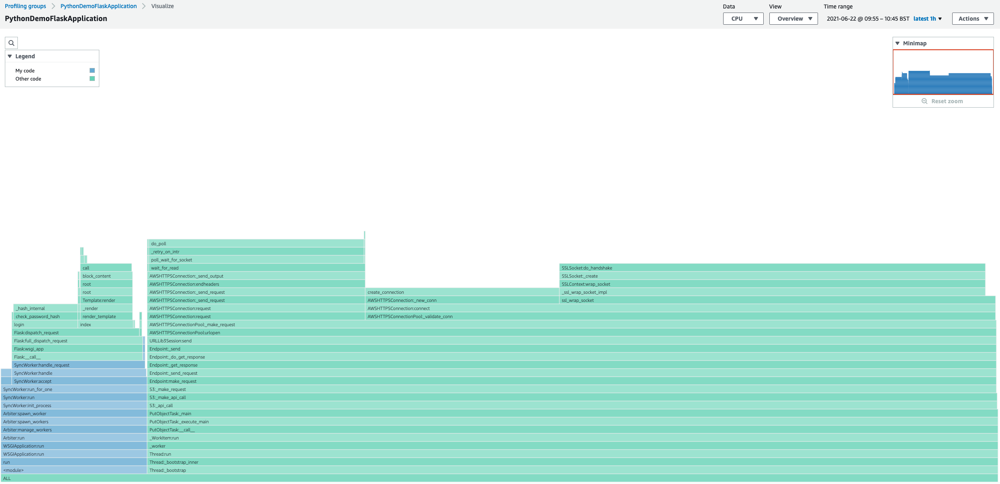

# Amazon CodeGuru Profiler Python Demo Applications

Simple Python applications for demonstrating the features of [Amazon CodeGuru Profiler](https://aws.amazon.com/codeguru/) using the Python agent that is open-sourced at [aws/amazon-codeguru-profiler-python-agent](https://github.com/aws/amazon-codeguru-profiler-python-agent).

Check the individual folders for each specific demo application.

## License

This code is licensed under the Apache-2.0 License. See the [LICENSE](LICENSE) file.
